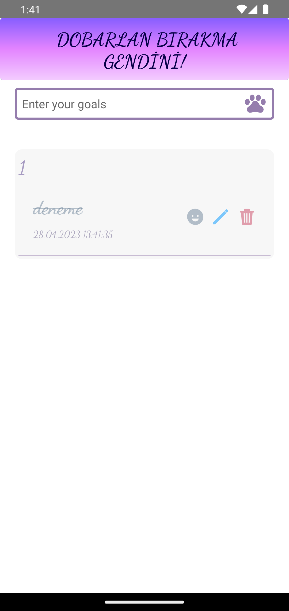

<h1> TodoApp with ReactNative</h1> 

<h2> This App created with React Native CLI </h2>   

<h3> WHICH LIBRARIES AND PACKAGES ARE USED IN THE APP? </h3>  

1. REACT NATIVE 
2. react-native-vector-icons  
3. react-native-linear-gradient  
4. REDUX-TOOLKIT  
5. react-native-async-storage/async-storage  

  

<strong> 

In this app;   You can add a goals, you can edit text of your goals or you can delete your goals   You will not lose your data because I am using async-storage. So, you can use this app in your android mobile.    

Please stay tuned for more 😉   

</strong> 

<h5> Project completed... </h5>  

<h4> You can download this app apk version and use your android phones.   For now, I don't publish Store 😐 </h4>  

[APK FILE DOWNLOAD LINK](https://github.com/habibecee/TodoApp-with-ReactNative/blob/master/assets/apk/app-release.apk)

<h3> APP VIEW </h3>  

  

| | |

|||

|||
